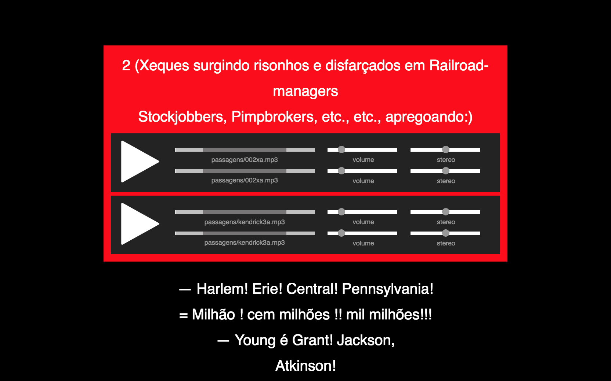

# Polyphonic Controller



## Description

Polyphonic Controller is web page that controls sound playback in other web pages. This project can be used to trigger multiple sound effects using one computer as a controller and other computers or phones as output devices to create sound installations.

This project was used to create the presentation *"Inferno Polyfonico"* by *Riverão*.

## Getting Started

To get started, download the code and install **node.js**. Then change the ``roteiro.json`` file with your own audio url's and text. You can put your audio files in the ``public/audio`` folder.

To star the server, use the command:

```bash
PORT=3000 node server.js
```

## Credits

Code created by *[James Peret](http://jamesperet.com)* and *Gregorio Gananian*. Audio files and text by *Riverão*
